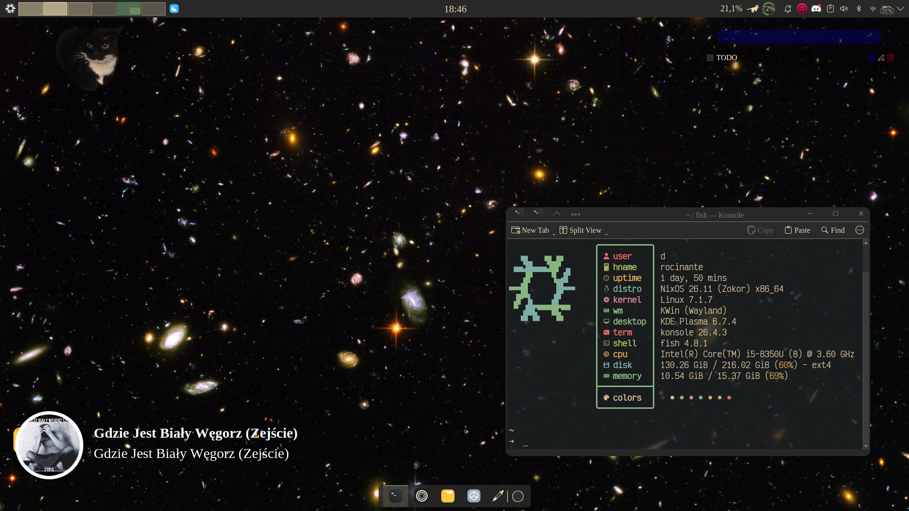

# NixOS Configuration

Flake-based NixOS and Home Manager configuration for rocinante (T480) and Hal (L15).



## Features

- NixOS 26.11 with flakes
- Home Manager integration
- KDE Plasma 6 desktop environment
- AGE-encrypted secrets via agenix
- Modular structure with shared modules

## Structure

```
.
├── flake.nix              # Flake file
├── flake.lock             # Lock file
├── hosts/
│   ├── Hal/               # HomeLab/gaming (L15)
│   │   ├── configuration.nix
│   │   ├── hardware-configuration.nix
│   │   ├── home.nix
│   │   └── packages.nix
│   └── rocinante/         # Daily driver (T480)
│       ├── configuration.nix
│       ├── hardware-configuration.nix
│       ├── home.nix
│       └── packages.nix
├── modules/
│   ├── nixos/             # Shared NixOS modules
│   └── home-manager/      # Shared Home Manager modules
├── system/                # System-level modules
│   ├── cider.nix
│   └── greetd.nix
├── programs/              # Home Manager programs
│   ├── nvim.nix
│   ├── fish.nix
│   ├── nushell.nix
│   └── LeChaton.nix
├── overlays/              # Package overlays
├── pkgs/                  # Custom packages
├── secrets/               # AGE-encrypted secrets
└── assets/                # Wallpapers and screenshots
```

## Hosts

| Hostname    | Model | Use Case               |
|-------------|-------|------------------------|
| rocinante   | Lenovo T480 | School/web/programming |
| Hal         | Lenovo L15  | Entertainment/game/HomeLab |

## Usage

```bash
# Build and switch to a host configuration
sudo nixos-rebuild switch --flake /path/to/dotfiles#host

# Update flake inputs
nix flake update
```


## Requirements

- Nix with flakes and experimental features enabled
- Hardware configurations are host-specific
- Secrets managed via AGE encryption (agenix)

## Technologies

- [Flakes](https://wiki.nixos.org/wiki/Flakes)
- [Home Manager](https://wiki.nixos.org/wiki/Home_Manager)
- [Agenix](https://wiki.nixos.org/wiki/Agenix) for secret management
- KDE Plasma 6

## Workaround: Mistral CLI

For `mistral-vibe` package build issues with pytest:

```nix
package = pkgs.mistral-vibe.overrideAttrs (old: {
  doInstallCheck = false;
});
```

## Notes

- Some hardware-specific settings remain in host configurations
- Not yet fully "Nix Way" - work in progress toward declarative purity
